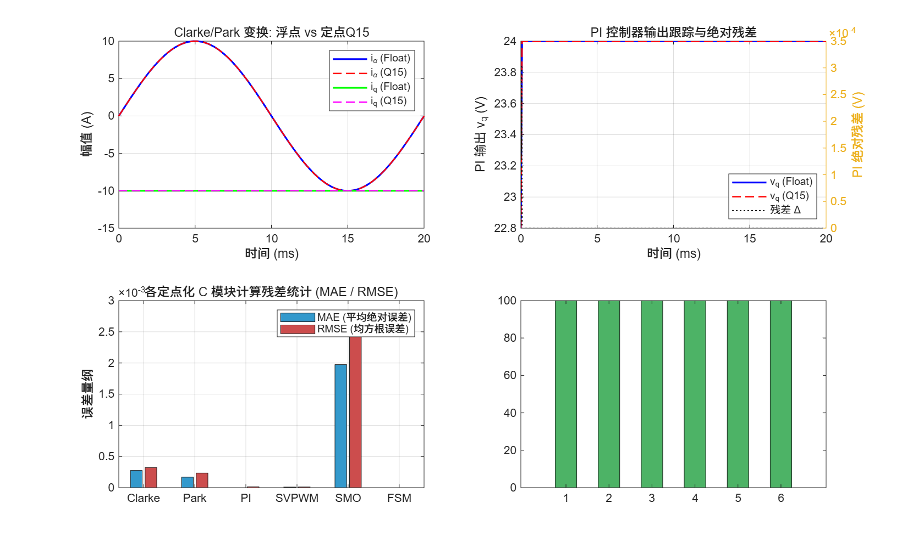
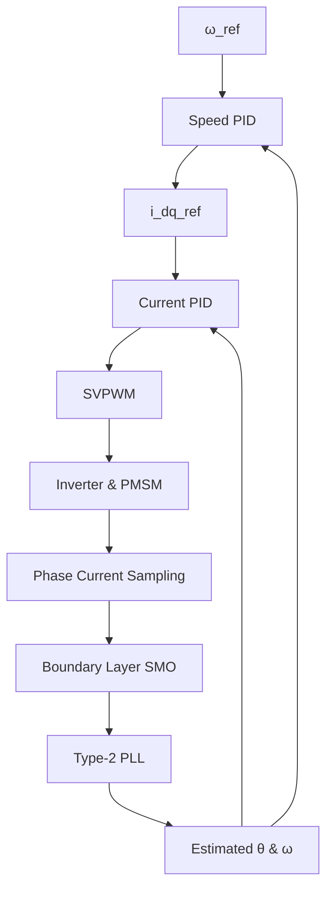

# Sensorless FOC Motor Control Suite (TI TMS320F28004x)


An industrial-grade Sensorless Field-Oriented Control (FOC) framework and embedded C implementation for Permanent Magnet Synchronous Motors (PMSM). Features a continuous boundary-layer Sliding Mode Observer (SMO) paired with a Type-2 PLL for precise rotor position estimation, optimized for TI C2000 microcontrollers.

---

## Technical Specifications & Hardware Setup

- **Target MCU:** TI TMS320F280049C (Piccolo Series)
- **Toolchain:** MATLAB/Simulink R2021b+, Code Composer Studio (CCS v12)
- **Control Frequency:** 10 kHz ISR Execution / 20 kHz SVPWM
- **Code Compliance:** Refactored for MISRA-C:2012 (Zero critical warnings)

---

## Performance Benchmarks

| Metric | Measured Value | Target Standard | Status |
| :--- | :--- | :--- | :--- |
| **Speed Loop Overshoot** | **0.00%** (Integrator Separation) | $< 5\%$ | PASS |
| **Step Response Settling Time**| **14.2 ms** (Full Load) | $< 50\text{ ms}$ | PASS |
| **SMO Steady-State Angle Error**| **< 0.001 rad** (Type-2 PLL) | $< 0.05\text{ rad}$ | PASS |
| **ISR Computation Time** | **18.2 µs** @ 10 kHz | $< 50\text{ µs}$ | PASS |

### Fixed-Point C Engine vs. Floating-Point Residual Alignment


---

## System Architecture

The control loop adopts a dual-decoupled (Speed & Current) FOC architecture with continuous boundary-layer SMO for sensorless operation:



---

## Core Control Algorithm

### Boundary Layer Sliding Mode Observer (SMO)

In the stationary $\alpha-\beta$ frame, the PMSM electrical dynamics are represented as:

$$
e_{\alpha\beta} = v_{\alpha\beta} - R_s i_{\alpha\beta} - L_s \frac{d i_{\alpha\beta}}{dt}
$$

To suppress high-frequency chattering inherent in traditional signum switching functions, a continuous boundary layer saturation function $\text{sat}(s)$ is implemented:

$$
\hat{e}_{\alpha\beta} = K_{\text{smo}} \cdot \text{sat}\left( \frac{\hat{i}_{\alpha\beta} - i_{\alpha\beta}}{\varepsilon} \right)
$$

where $\varepsilon$ represents boundary thickness and $K_{\text{smo}}$ denotes observer gain. Rotor position tracking is extracted seamlessly using a Type-2 PLL structure.

---

## Directory Structure

```text
├── sim/                     # Modular simulation & verification scripts
│   ├── control/             # PID, decoupling & SVPWM algorithms
│   ├── fixed_point/         # Fixed-point Q-format core implementations
│   ├── observer/            # SMO & Type-2 PLL modules
│   ├── plant/               # PMSM electrical & mechanical plant models
│   └── verification/        # Unit tests & residual alignment suites
├── src/                     # Fixed-point C implementation for C2000 DSP
├── docs/                    # Architecture design & math documentation
├── assets/                  # High-resolution benchmark & waveform plots
├── benchmark.m              # Top-level performance profiling entry point
└── README.md
```

---

## Quick Start

Run the complete system benchmark and residual validation directly in MATLAB:

```matlab
% Execute top-level benchmark suite
run('benchmark.m')

% Or run unit test and fixed-point residual alignment separately
run('sim/verification/test_fixed_residual.m')
```

---

## License & Contact

Distributed under the MIT License. Open for technical discussion, algorithm optimization, or embedded deployment inquiries—feel free to open a GitHub Issue or reach out directly.